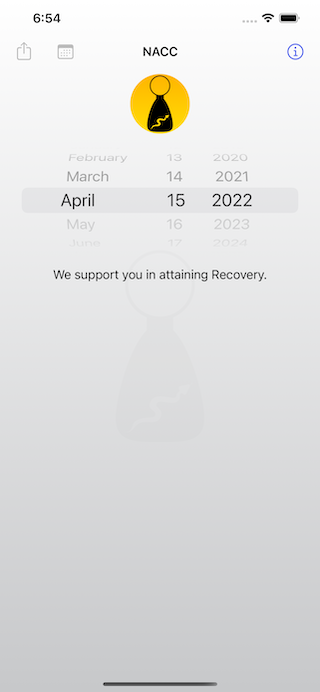
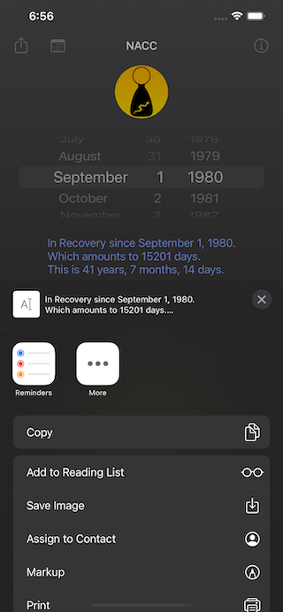
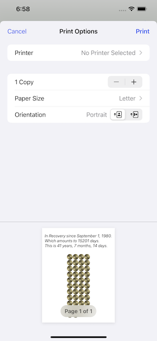
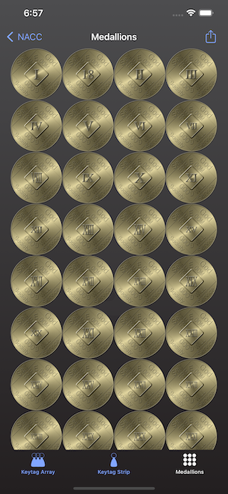

# ``NACC (NA Cleantime Calculator)``

## Overview

This is a simple "cleantime calculator" app, for NA members (It is not associated with [Narcotics Anonymous World Services](https://na.org), or NA, as a whole. It is simply a tool, written for NA members, by NA members).

## Get The App

### Get the application, itself

|The app is available for free, from the iOS/iPadOS/MacOS Apple App Store|
|:--:|
||

### Get the source code

|The Source Is Available, As [MIT-licensed](https://opensource.org/licenses/MIT) Open-Source Code, on GitHub|
|:--:|
||

### Read All About It

- [Complete Technical Documentation is Available on GitHub](https://littlegreenviper.github.io/NACC/)

- [Complete User Documentation is Available on the Little Green Viper Software Development LLC Web Site](https://littlegreenviper.com/portfolio/nacc/)

## Basic Operation

> NOTE: As of version 5.4.0, there is now a widget available. This can be configured to display the latest keytag, medallion, text report, or all of the above.

### The Initial ("My Cleantime") Screen

The initial screen that you see, upon starting the app, has a basic "wheel-style" date entry that allows you to enter a cleandate. Once you have entered a date, the label below the date entry changes into a report of the cleantime, and also becomes a "selectable" button.

|Figure 1: The Initial Screen|Figure 2: After Changing the Date|Figure 3: Dark Mode|
|:----:|:----:|:----:|
||||

Tapping on the "Info" button will bring in a screen, displaying information about the app.

Tapping on the "action" button will allow you to share the report with others, using different apps, like [Messages](https://apps.apple.com/us/app/messages/id1146560473), or [Mail](https://apps.apple.com/us/app/mail/id1108187098).

Tapping on the "calendar" button will allow you to create calendar reminders, every year, starting from the cleandate.

|Figure 4: Action Screen|Figure 5: Calendar Screen|Figure 6: Print Screen|
|:----:|:----:|:----:|
||||

### The Cleantime Commemoration Tab Screen

If you select the cleantime report, it will bring in another screen, that will have three tabs. These tabs will display the cleantime, using keytags or medallions:

Tapping on the logo will take you to the results, as an array of keytags.

Tapping on the keytag (or medallion) will take you to the results as either medallions, or as the array of keytags.

|Figure 6: Keytags in an Array|Figure 7: Keytags in a Vertical Strip|Figure 8: Medallions in an Array|
|:----:|:----:|:----:|
||||

You can scroll these displays, and also do a pinch-to-zoom.

If you select the action button, you will now be able to print the display, share it (and the report), via [Messages](https://apps.apple.com/us/app/messages/id1146560473), or [Mail](https://apps.apple.com/us/app/mail/id1108187098), or save the image into your Photo Library.

The app remembers the last date entered, and the last tab selected. In some cases, tabs may not be enabled (If you have entered a date less than 30 days in the past, then only the Keytag Array tab is enabled. If less than 1 year, then the Medallions tab is disabled).

## URL Scheme

The app can be opened from other apps (like [Safari](https://apps.apple.com/us/app/safari/id1146562112) or [Mail](https://apps.apple.com/us/app/mail/id1108187098)), using a special URL scheme.

The URL scheme is thus:

**`nacc://`**_[?YYYY-MM-DD[/N]]_

The Universal Link Scheme is:

**`https://nacc.littlegreenviper.com/`**_[?YYYY-MM-DD[/N]]_

_YYYY-MM-DD_ is a standard [ISO 8601 calendar date](https://en.wikipedia.org/wiki/ISO_8601#Calendar_dates) (For example, September first, 1980, is 1980-09-01).

The earliest date is October 5, 1953 (1953-10-05)

_N_ is the numerical index of a tab:

- 0 is Keytag Array
- 1 is Keytag Strip
- 2 is Medallions

|Figure 10: URL Entry In Safari|Figure 11: Permission Alert|
|:----:|:----:|
|||

### Example URL Scheme URLs

(Will only work on a device with NACC installed)

- [`nacc://`](nacc://)
  This opens the app, but does nothing else.

- [`nacc://?1980-09-01`](nacc://?1980-09-01)
  This opens the app, and sets the cleantime to September 1st, 1980. It will set to the main screen.

- [`nacc://?2020-03-17/0`](nacc://?2020-03-17/0)
  This opens the app, and sets the cleantime to March 17th, 2020. It will open the commemoration tab screen, to the Keytag Array tab.

- [`nacc://?2020-03-17/1`](nacc://?2020-03-17/1)
  This opens the app, and sets the cleantime to March 17th, 2020. It will open the commemoration tab screen, to the Vertical Keytag Strip tab.

- [`nacc://?2020-03-17/2`](nacc://?2020-03-17/2)
  This opens the app, and sets the cleantime to March 17th, 2020. It will open the commemoration tab screen, to the Medallions tab.

### Example Universal Link URLs

_Will work on any device, but will open the NACC, if it is installed. If not, a simple Web page with the date will be shown, along with instructions for accessing the app on the App Store_

- [`https://nacc.littlegreenviper.com`](https://nacc.littlegreenviper.com)
  This opens the app, but does nothing else.

- [`https://nacc.littlegreenviper.com/?1980-09-01`](https://nacc.littlegreenviper.com/?1980-09-01)
  This opens the app, and sets the cleantime to September 1st, 1980. It will set to the main screen.

- [`https://nacc.littlegreenviper.com/?2020-03-17/0`](https://nacc.littlegreenviper.com/?2020-03-17/0)
  This opens the app, and sets the cleantime to March 17th, 2020. It will open the commemoration tab screen, to the Keytag Array tab.

- [`https://nacc.littlegreenviper.com/?2020-03-17/1`](https://nacc.littlegreenviper.com/?2020-03-17/1)
  This opens the app, and sets the cleantime to March 17th, 2020. It will open the commemoration tab screen, to the Vertical Keytag Strip tab.

- [`https://nacc.littlegreenviper.com/?2020-03-17/2`](https://nacc.littlegreenviper.com/?2020-03-17/2)
  This opens the app, and sets the cleantime to March 17th, 2020. It will open the commemoration tab screen, to the Medallions tab.

## Dependencies

The app is dependent upon the following 3 [Great Rift Valley Software Company](https://riftvalleysoftware.com) SPM modules:

- [RVS_BasicGCDTimer](https://github.com/RiftValleySoftware/RVS_BasicGCDTimer)
- [RVS_Generic_Swift_Toolbox](https://github.com/RiftValleySoftware/RVS_Generic_Swift_Toolbox)
- [RVS_PersistentPrefs](https://github.com/RiftValleySoftware/RVS_PersistentPrefs)

It is also dependent upon the following 2 [Little Green Viper Software Development LLC](https://littlegreenviper.com) SPM modules:

- [LGV_Cleantime](https://github.com/LittleGreenViper/LGV_Cleantime)
- [LGV_UICleantime](https://github.com/LittleGreenViper/LGV_UICleantime)

## License And Copyright

The code and keytag images are [MIT license](https://opensource.org/licenses/MIT). Use them as you will.

However, the medallion images are renderings of the standard bronze [NA World Services](https://na.org) (NAWS, Inc.) [cleantime commemoration medallions](https://cart-us.na.org/2-keytags-medallions/medallions-bronze/bronze-medallions-bronze). The design of those medallions is copyrighted by NA World Services.

It is important to treat the intellectual property of NA with respect.

